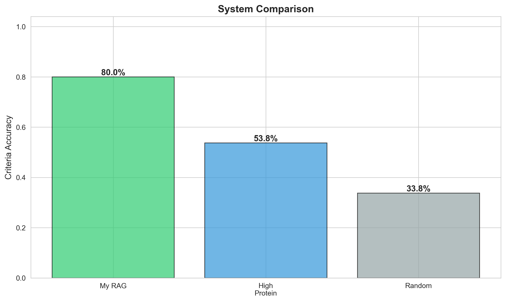
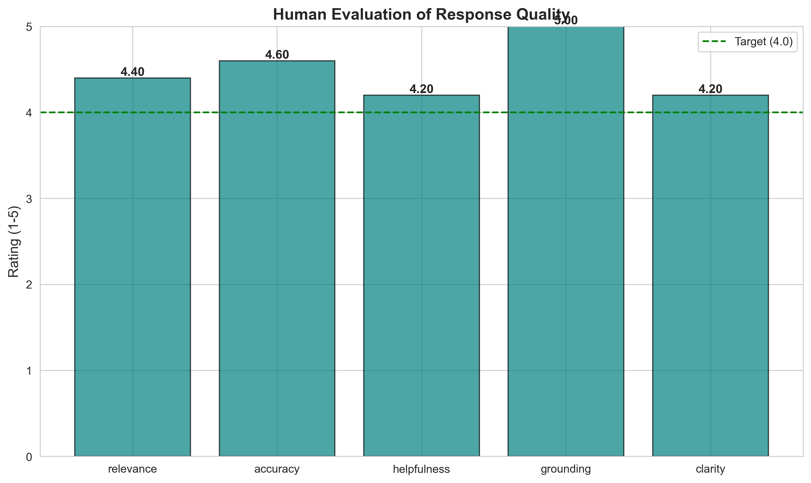
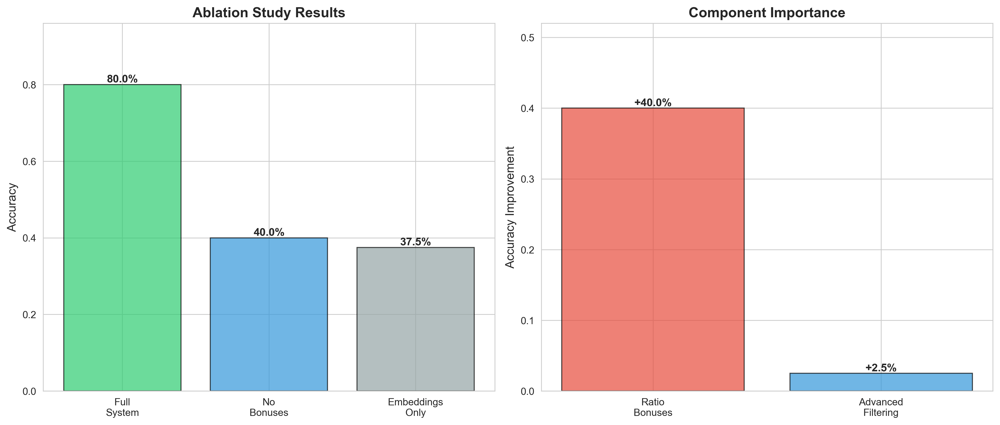

# CS 372 Final Project: Duke Net Nutrition AI Assistant README
## Introduction
Duke Net Nutrition is a deployed AI-powered meal recommendation system using RAG to suggest personalized nutrition options from 1k+ Duke dining hall menu items. All nutrition information scraped off of Duke's NetNutrition website.

## What it Does
The Duke Nutrition AI Assistant combines semantic search with Sentence Transformers with GPT-4's natural language understanding to recommend meals from Duke's dining halls. The project supports multi-turn conversations, remembers dietary restrictions (vegan, vegetarian, halal, gluten-free), and optimizes recommendations based on nutrition and macro ratios for specific nutrition goals like cutting, bulking, keto, post-workout recovery, high fiber intake, and etc. Some key features include context memory, real-time nutrition display, refining recommendations based on follow-up questions, semantic search with 384-dimensional embeddings, macro ratio bonuses that go beyond keyword matching (e.g., prioritizes protein percentage for cutting, not just absolute grams).

## Quick Start

### 1) Launch the application live: https://duke-nutrition-app.streamlit.app/

OR

### 2) Launch the application locally:
1. git clone https://github.com/hwang0/duke-nutrition-app
2. cd duke-nutrition-app
3. pip install -r requirements.txt
4. Set up API Key: Create .streamlit/secrets.toml -> OPENAI_API_KEY = "your-openai-api-key-here"
5. streamlit run app.py

## Video Links
**Project Demo**: https://drive.google.com/file/d/18xHkmHTzXuhnGUgLpxvH8Eay8eyoqkaK/view?usp=sharing

**Technical Walkthrough**: https://drive.google.com/file/d/1BlbyYMLBh2SKmnOsri2NeUdqAUcYlK29/view?usp=sharing

## Evaluation

### Quantitative Metrics
1. Criteria Accuracy (Percentage of retrieved items meeting nutritional criteria): 80.0 %
2. Semantic Similarity (Average cosine similarity between query and retrieved items): 0.459
3. Top-1 Hit Rate (Percentage of queries where #1 recommendation is nutritionally valid): 87.5%

**80% overall accuracy** across 16 diverse test queries covering 7 nutrition goals

**87.5% top-1 hit rate** means 14/16 queries got a perfect first recommendation (higher than overall accuracy, showing effective ranking)

**0.459 semantic similarity** shows moderate semantic alignment (embeddings capture meaning but need nutrition intelligence for high accuracy)

### Baseline Metrics
1. Random Selection(Baseline): 40.0% (Randomly selects 5 items from menu (worst case)
2. Keyword Matching (High Protein): 53.8% (Always returns the 5 highest-protein items, ignoring query context)
3. ##### RAG System (My Model): 80.0% (Semantic understanding of query intent)

A simple "always high protein" heuristic achieves 53.8% accuracy, demonstrating that protein optimization is a common pattern in nutrition queries
- However, RAG system's intelligent understanding of different nutrition goals achieves **80% accuracy**, a **49% relative improvement** over the protein heuristic
- The model's ability to distinguish between goals (e.g., keto requires high fat, not just high protein) is important for the performance gain

### Qualitative Metrics

**Rated responses on 1-5 scale across 5 criteria to get human quality assessment**

**Average human rating**: 4.48/5.0 across 5 criteria:

**Relevance**: 4.4/5.0 (Recommendations match user intent)

**Accuracy**: 4.6/5.0 (Nutritional soundness of suggestions)

**Helpfulness**: 4.2/5.0 (Practical value for Duke students)

**Grounding**: 5.0/5.0 (Only recommends actual Duke menu items)

**Clarity**: 4.2/5.0 (Clear explanations of recommendations)

### Ablation Study

**Full System**: 80.0% -> Embeddings + Filtering + Ratio Bonuses | Baseline

**No Ratio Bonuses**: 40.0% | Embeddings + Filtering only | -40 percentage points

**Embeddings Only**: 37.5% | Pure semantic search | -42.5 percentage points

**Component Importance:**

1. **Nutrition-Aware Ratio Bonuses (Ratios generated by AI)**: +40.0% improvement
   - **Contribution**: Most critical component --> accounting for 50% of total accuracy
   - **Purpose**: Re-ranks results based on macro nutrient ratios (protein %, carb %, fat %)
   
   **Why it's essential:**
   - Semantic search finds items with "protein" in the text
   - Ratio bonuses distinguish:
     - **Cutting**: Needs high protein % (40% of calories from protein)
     - **Bulking**: Needs high absolute protein (30g+) with calories
     - **Keto**: Needs high fat %, low carb % (not just high protein)
     - **Endurance**: Needs high carb %, not protein
   
2. **Advanced Filtering**: +2.5% improvement
   - **Contribution**: Modest but necessary for quality
   - **Purpose**: Filters out non-meal items (such as condiments, protein powders, toppings)
   - **Impact**: Prevents obviously incorrect results like "whey protein powder" as a meal

**Key Finding:** The nutrition-aware ratio bonus system is the **dominant contributor** to performance, providing +40 percentage points of improvement. This shows that **domain-specific intelligence is essential**—pure semantic similarity (37.5%) performs barely better than random selection (33.8%). The system's strong performance comes primarily from understanding nutrition science, not just better text matching.

